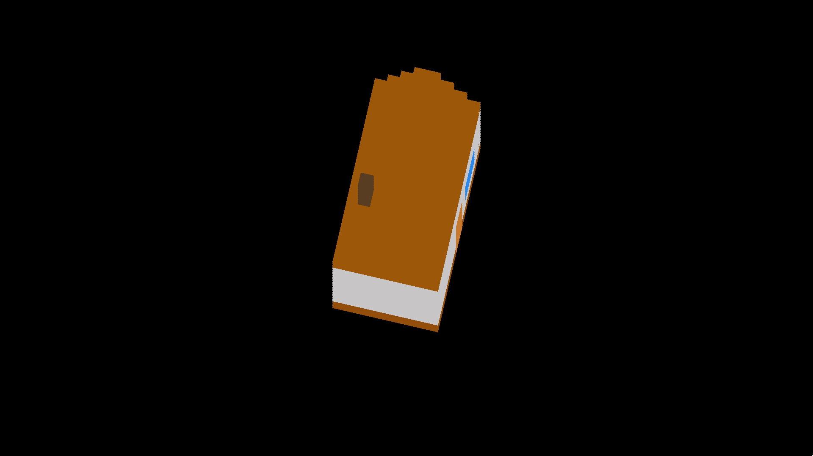

# Poxel-viewer - Pixel-based voxel viewer

Poxel¹ (**P**ixel V**oxel**) is a way of rendering 3D-like graphics through a 2D
interface by layering sprites. It is easily to implement, relatively cheap to
render, editable through a voxel editor (for example,
[goxel](https://github.com/guillaumechereau/goxel) and
[vox2png](https://github.com/StijnBrouwer/vox2png)), and finally has a very
unique style to it.

This repository contains a small program which reads a BMP file and allows you
to view the output (see `house.bmp` to see the input file):

¹I coined this term as I couldn't find anything existing. However the idea is
not new, it appears to have used in a handful of games before (e.g. Lisa the
dog).

## Manual

    SYNOPSIS
        poxel-viewer [flags] [bmp file]

    FLAGS
        -w [px], --width [px]        : Set the width of each layer to [px] pixels
        -s [px], --step [px]         : Set the step in Y between every layer to [px] pixels
        -z [factor], --zoom [factor] : Zoom in by [factor]
        -h, --help                   : Print this help page
        -R, --disable-rotation       : Disable automatic rotation

    CONTROLS
        Q, escape : Quit the program
        J, left   : Rotate left
        K, right  : Rotate right
        +         : Zoom in
        -         : Zoom out
        R         : Reload file
        space     : Toggle rotation

# Related links

- https://github.com/StijnBrouwer/vox2png - Turn MagicaVoxel files into PNGs.
- https://github.com/guillaumechereau/goxel - A voxel editor, which can output MagicaVoxel files.
- https://rubna.itch.io/lisa - A game that uses same method of rendering.
- https://www.youtube.com/watch?v=_BztMPC5Kk4 - Another game that uses same rendering technique.
